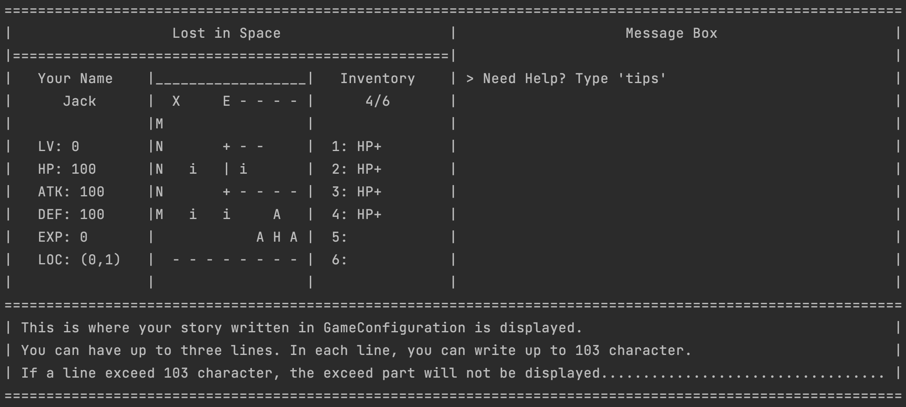

FOR casual players who want to play some simple games, THE "Lost in Space" is a terminal-based RPG game THAT only runs on the terminal with low system requirement. UNLIKE, many other terminal-based games that only provide text-based UI, OUR product provides a concise GUI made up of symbols where the player can see what the map looks like, where the player and NPCs and enemies are on the map, the first six items in the player's inventory, and the current stats of the player.

FOR game designer who wants to make their own simple RPG game, THE "Lost in Space" provides a customisable game engine where the game designer can change everything, including the map, NPCs, enemies, merchants and item at each game level and the number of game levels. UNLIKE, many other game engines that require lots of set-up process and learning costs, OUR product only needs game designers to know how to edit a single `GameConfiguration` file and create game states as the representation of each game level in a game.

