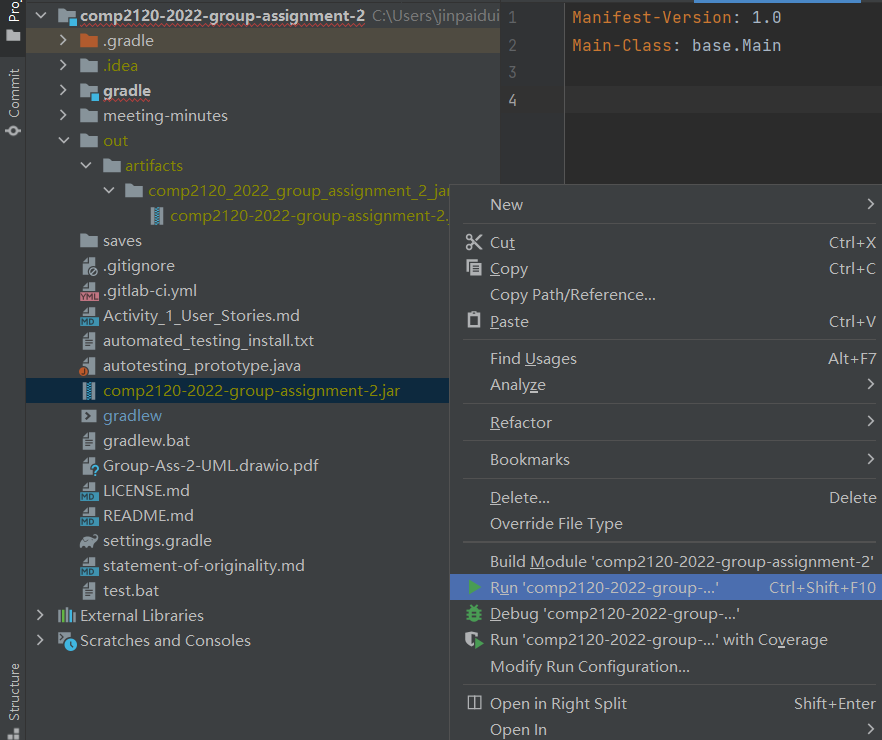

1. Download the latest version of "Intellij IDEA CE" on <<https://www.jetbrains.com/idea/>>.

2. Clone this git repo somewhere on your computer.

3. Open with Intellij and wait for Intellij to build Gradle automatically.

4. The best supported SDK of this project is Java 18.

5. To start the game, run the program `base.Main` in master branch `gradle/src/main/java/base/Main.java`.

6. (optional) if you don't want to do step 5, you can try run `lost_in_space_java_18.jar` in root directory 

