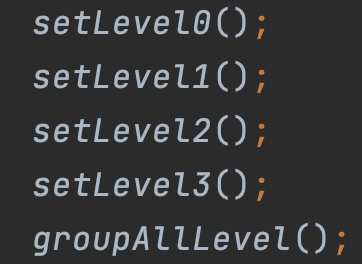

The game is customisable in `gradle/src/main/java/base/GameConfiguration.java`.

### Three major components in `GameConfiguration.java`.

1. Static constants such as `GAME_TITLE`, `INITIAL_HP`, and `DEFAULT_UNIT_NAME`, editing them will change the default value when creating Java objects in the game, and some attributes such as `INITIAL_ATK` may affect the game difficulty.
2. `LEVELX_INITIAL_STATE` and `LEVELX_LEVEL_UP_REQUIREMENT`.  A game contains a list of game levels. At each level, there is an initial game state `State` and a requirement to proceed to the next game level `GameLevelUpRequirement`.  The game started by loading `LEVEL1_INITIAL_STATE`. If the current game state satisfies `LEVEL1_LEVEL_UP_REQUIREMENT`, then the game load `LEVEL2_INITIAL_STATE` by changing the map, NPCs, etc., but keep the player's attributes unchanged.
3. A `initialise()` function which initialises all of these attributes above.

In gradle/src/main/java/base/GameConfiguration.java Customize your own map with following components: map String\[\], Player location, game level-up requirement, dialogue to display in story block. Enemies location (optional), npc dialogue and location(optional), item location (optional), merchant dialogue and location (optional), merchant's trades (optional).

### Step-by-step process to make a game level.

Assume you want to make level 2 of the game.

##### Step 1

Define `LEVEL2_INITIAL_STATE` and `LEVEL2_LEVEL_UP_REQUIREMENT` in this class.

##### Step 2

Create a map for this level

A `Map` contains

- an array of 9 `String`, each line is a `String` with a length of 9.
- map id.
- char\[\] that indicates walls on the map.

##### Step 3

Create a story for this level

This story will be shown in the story box in the GUI when the player is at this level. For the story to be displayed correctly, a story needs to be

- Contains at most three lines.
- Each line contains less than 103 characters.
- If a line exceeds 103 characters, the exceeding part will not be displayed.

##### Step 4

Set the initial location of the player by making a dummy `Player`. For example, define `Player player = new Player(new Location(0,1));`

##### Step 5

Create an NPCs list.

Define `List<NPC> NPCs = new ArrayList<>();`. If you don't want this level to contain NPCs, just leave it empty.

Create an NPC.

An NPC has a name, location, and dialogue, such as `NPC Bob = new NPC("Bob", new Location(2,0), bobSays);`

Dialogue is an array of strings with a specific format.

For each string in this array
- The first two strings are how the player and NPC say goodbye to each other
- String from string\[2\] are their talks.
- string starts with nothing means NPC's saying
- string starts with "` `" means the player's saying.
- string starts with "> " means your optional saying
- string starts with "< " means NPC's answer according to what you was say.

After creating an NPC, add the NPC to the NPC list.

##### Step 6

Create an Items list.

Define `List<Item> items = new ArrayList<>();` If you don't want this level to contain any item on the map, just leave it empty.

There are two constructors for an item,

For creating normal item, use `Item item1 = new Item(location, itemType);`

For creating a key item, use 

`Item itemRequired = new Item("Key Item Name", Location);`

An item with location `null` will be invisible when placed on the map. Please make sure there is at most one key item in each game level.

After creating an NPC, add the NPC to the NPC list.

##### Step 7

Create a Merchants list.

Define `List<Merchant> merchants = new ArrayList<>();`. If you don't want this level to contain Merchants, just leave it empty.

Create a Merchant.

A merchant has a name, location, dialogue, and a list of `Trade`. For example, 

`Merchant m = new Merchant("Amy", new Location(1,0), new String[]{"Goodbye", "Hope to deal with you again!","Welcome to my store!"}, trades));`

The dialogue is an array of strictly three strings. The first two strings are how the player and the merchant say goodbye. The last string is how the merchant says hello to the player.

A `Trade` is a pair of items. The first element is the item that the merchant accepts from the player, and the second is the item that the merchant will give to the player in return.

##### Step 8

Create an Enemy list.

Here is an example of making an enemy.

`Enemy e = new Enemy("Goblin1",10,150,50,new Location(0,4),20, item);`

An enemy has a name, atk, def, hp, loc. The second last argument is how much exp a player will obtain after killing the enemy. The last argument is what the player will get after killing the enemy.

##### Step 9

Group all objects created above into a `State`

For example, define `LEVEL2_INITIAL_STATE = new State(mapOBJ, story, 0, player, enemies, items, NPCs, merchants);`

Notice if you set an attribute of a state with level >= one as `null`. When the game proceeds from one state to the other state, it will keep the attribute from the previous state. For example, if you want level 2 to have the same map as level 1, you can set the map attribute of `LEVEL2_INITIAL_STATE` as null. When the current game state proceeds to level 2, the map will not be changed.

##### Step 10

Set up Game Level up requirement by defining `LEVEL0_LEVEL_UP_REQUIREMENT = new GameLevelUpRequirement(destination,enemiesMustBeKilled,itemRequired);`

A GameLevelUpRequirement object contains the following three attributes

- Next Level entrance location (Location)
- Enemies that are required to kill before level-up (List\<Enemy\>)
- Key that are required to pick up before level-up (Item)

##### Step 11

Group all the code from 2 to 10 into a function called `private static void setLevel1 ()`.

call this function in the function `public static void initialise()`

##### Step 12

Added `LEVEL2_INITIAL_STATE` and `LEVEL2_LEVEL_UP_REQUIREMENT` into `GAME_STATES` and `LEVEL_UP_REQUIREMENTS`, respectively.

