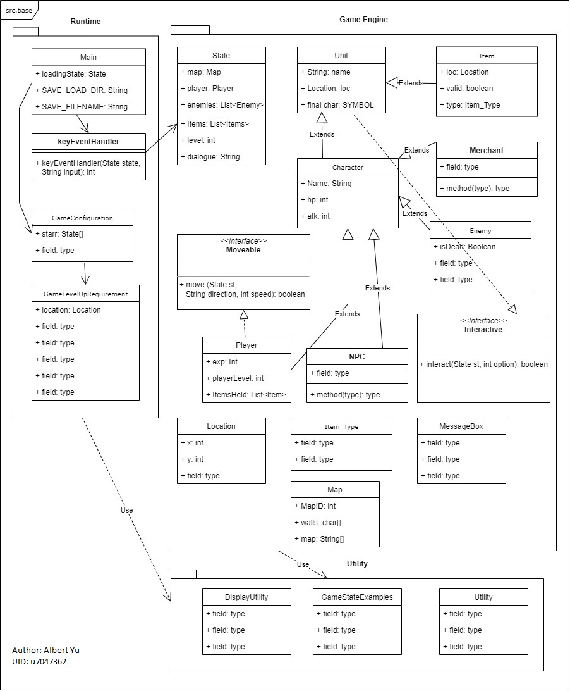

Attached here is the Game Engine UML Diagram.
The UML diagram consists of 3 major parts:
- **Runtime**: this package "runs" the game. Also, configurations are contained here too.
- **Game Engine**: this package contains the foundational classes upon which games are built upon.
- **Utility**: this package contains utility classes.