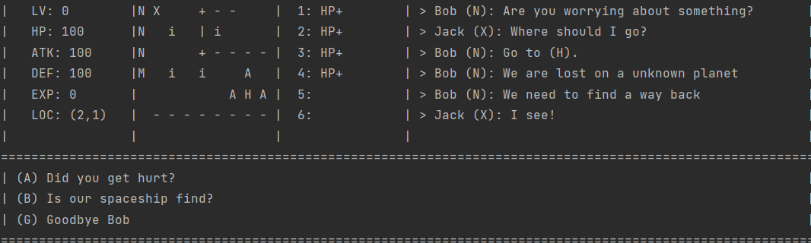

# Project summary

## lost in space.  

lost in space is developed by Haoting Chen, Albert Yu, William Barter, Mohan Balaji Paranthaman and Zhishang Bian. This game is developed by our own in intellij using java 18

## features:

- user can view gui during playing (`Stats`,`Inventory`,`Title page`,`message box`,`story`)

- we provide four continuous maps in our game.

- users can move, pick up item (see 3 [how to play the game)](3-How-to-play-the-game%3F)

- users can fight against Enemy 

- users can interact with NPC and talk with them, player can select what to say, the NPC will answer according to player's question

- users can interact with merchant and do trading with them

- users can gain experience after they kill Enemy

- users must meet some requirement before they level-up

- user can pick up items

- users can type in "tips" or "quest" to gain more information

- **users are able to customize the aboving stuff and make their own map (see 5 [how to use game engine to customise the game](5-How-to-use-the-game-engine-to-customise-the-game%3F))**

- game has automate test as well as unit test to test maintainance (see [Automate Game Tester](Automatic-Game-Tester))

- gitlab CI to test the game everytime developers do a push (see [Automate Game Tester](Automatic-Game-Tester))

- users can do saving and loading (see 3 [how to play the game](3-How-to-play-the-game%3F))

## Description of game 
- see 1 [product vision](1-Product-Vision)

## Planned to do but didn’t have time to implement 
- see [Potential Improvement](Potential-Improvements)

## Additional notes or information about the game/your process 
- 1 [Product Vision](1-Product-Vision)
- 2 [How to install the game](2-How-to-install-the-game%3F)
- 3 [How to play the game](3-How-to-play-the-game%3F)
- 4 [How does the game work intuitively](4-How-does-the-game-work-intuitively%3F)
- 5 [How to use game engine to customise the game](5-How-to-use-the-game-engine-to-customise-the-game%3F)

## Evidence of planning and scheduling of tasks/issues：
- see Issues and team-meetings

## Document meeting minutes, team structure/roles 
- see [group meeting](meeting-minutes)

## installation and setup section detailing 
- see 2 [How to install the game](2-How-to-install-the-game%3F)

## Lost in space UML diagram
[assgn_2.pdf](uploads/6ea22827d390c957ebe277cd26ba5a4e/assgn_2.pdf)

## License

we choose mit license since mit license is simple and it can ensure that our project is used for studing usage or commerical usage. 

Referring our project requires preservation of copyright and license notices.

written by Zhishang Bian